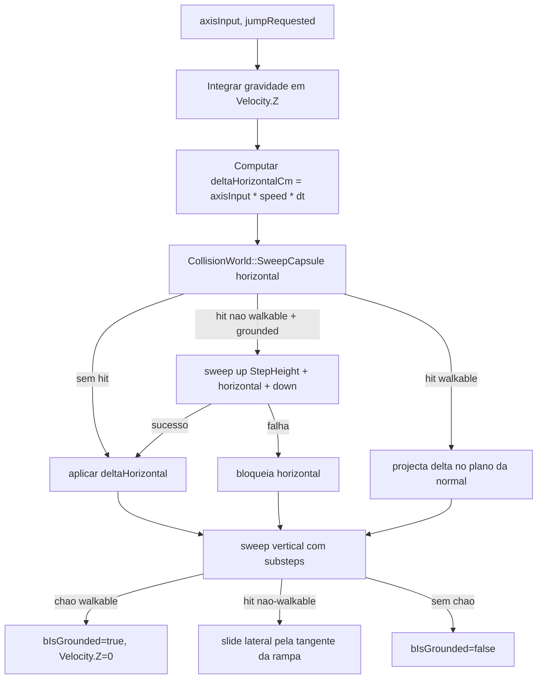

# MOVEMENT — Parte 5 (Movement Foundation)

Este documento descreve o sistema de movimento autoritativo do Zeus Server Engine: cápsula servidor-only, **sweep & slide** com Jolt `CastShape`, gravidade, **walkable floor** e **step up**, encapsulados num novo módulo `ZeusGame`.

A Parte 5 ainda **não** inclui replicação, predição, ou integração com input de cliente. O alvo é validar o pipeline `axisInput → MovementComponent → CollisionWorld → PhysicsWorld(Jolt)` em smoke tests determinísticos a 30 Hz.

---

## 1. Princípios

- **Servidor é autoritativo**. O cliente apenas envia intenção (axis/jump); o servidor resolve a física.
- **Sweep real**, não AABB resolution. A cada movimento horizontal/vertical o servidor consulta `CollisionWorld::SweepCapsule` que delega em `JPH::NarrowPhaseQuery::CastShape`.
- **Cápsula Z-up**. `JPH::CapsuleShape` é Y-up por default; o `PhysicsWorld` envolve-a numa `RotatedTranslatedShape` com rotação +90° em torno de X para alinhar o eixo principal a Z (convenção Zeus / Unreal).
- **Walkable floor** baseado no ângulo da normal: `normal.Z >= cos(MaxSlopeAngleDeg)`.
- **Step up determinístico** com sweep up + sweep horizontal + sweep down.
- **Substepping** vertical para evitar tunneling em quedas longas (cada substep ≤ `CapsuleRadius * 0.5`).
- Sem dependência directa entre `ZeusGame` e Jolt: o componente de movimento só conhece `CollisionWorld`.

---

## 2. Arquitetura — módulo `ZeusGame`

```
ZeusServer
└── ZeusGame
    ├── Entities        → CharacterActor (servidor-only)
    ├── Movement        → MovementComponent + MovementSystem + MovementTests
    ├── Combat          (placeholder — futuro)
    ├── Spells          (placeholder — futuro)
    ├── Skills          (placeholder — futuro)
    ├── AuraStatus      (placeholder — futuro)
    ├── Inventory       (placeholder — futuro)
    ├── LagCompensation (placeholder — futuro)
    └── Rules           (placeholder — futuro)
```

`ZeusGame` depende de `ZeusWorld`, `ZeusCollision`, `ZeusMath`, `ZeusPlatform`, `ZeusCore`. Não toca `ZeusNet`/`ZeusProtocol`/`ZeusSession`.

---

## 3. Pipeline por tick



`StepHorizontal` chama `TrySweep` em loop com até `kMaxSlideIterations` iterações, projectando o `desired` restante quando bate em superfícies walkable. `StepVertical` divide `Velocity.Z * dt` em substeps de no máximo `CapsuleRadius * 0.5` cm.

---

## 4. APIs públicas

### `Zeus::Game::Entities::CharacterActor`

Deriva de `Zeus::World::Actor`. Tags `"Character"` e `"PlayerProxy"`. Cápsula lógica:

- `CapsuleRadiusCm` (default 35 cm).
- `CapsuleHalfHeightCm` (default 90 cm — total 180 cm).

`OnSpawned` cria automaticamente um `MovementComponent` filho, propagando o tamanho da cápsula para `MovementParameters`.

### `Zeus::Game::Movement::MovementComponent`

Deriva de `Zeus::World::ActorComponent`.

```cpp
struct MovementParameters {
    double GravityZ = -980.0;
    double MaxSlopeAngleDeg = 45.0;
    double StepHeightCm = 45.0;
    double DefaultSpeedCmS = 600.0;
    double JumpVelocityCmS = 600.0;
    double CapsuleRadiusCm = 35.0;
    double CapsuleHalfHeightCm = 90.0;
};

void MoveByAxis(double forward, double right);
void Jump();
void Stop();
void TeleportTo(const Math::Vector3& location);
const Math::Vector3& GetVelocity() const;
const Math::Vector3& GetFloorNormal() const;
bool IsGrounded() const;
```

`SetCollisionWorld(CollisionWorld*)` é obrigatório antes do primeiro tick. Sem `CollisionWorld` o componente fica inerte (logs em debug).

### `Zeus::Game::Movement::MovementSystem`

Façade thin para configuração e estatísticas.

```cpp
struct MovementStats {
    int CharacterCount = 0;
    int GroundedCount = 0;
    int SweepsLastTick = 0;
    Math::Vector3 AvgVelocity;
};

void Configure(const MovementParameters&);
void SetCollisionWorld(CollisionWorld*);
void RefreshAllComponents(World&);
MovementStats RefreshStats(World&);
```

Não substitui o `World::Tick`; serve para distribuir `MovementParameters` por componentes recém-spawnados e produzir métricas para o `ConsoleLivePanel`.

---

## 5. Sweep no `PhysicsWorld`

Adicionado nesta parte:

```cpp
struct SweepHit {
    bool bHit = false;
    double Fraction = 1.0;
    double Distance = 0.0;
    Math::Vector3 ImpactPoint;
    Math::Vector3 ImpactNormal;
    std::uint32_t BodyId = 0;
};

bool SweepCapsule(const Math::Vector3& centerStartCm, double radiusCm,
                  double halfHeightCm, const Math::Vector3& sweepCm,
                  SweepHit& outHit) const;
```

Implementação interna usa `JPH::RShapeCast` + `ClosestHitCollisionCollector`. A cápsula é sempre construída via `MakeZUpCapsule(cylHalf, radius)` que aplica:

- `cylHalf = halfHeightCm - radiusCm` (Jolt espera o half-height **do cilindro central**, sem semi-esferas).
- `RotatedTranslatedShape` com `Quat::sRotation(AxisX, π/2)` para tornar a cápsula Z-up.

`ShapeCastSettings` configurados para character movement:

- `mBackFaceModeTriangles = CollideWithBackFaces`
- `mBackFaceModeConvex = CollideWithBackFaces`
- `mReturnDeepestPoint = true`
- `mActiveEdgeMode = CollideWithAll`

A normal final retornada aponta **do mundo para a cápsula** (convenção esperada pelo movement code).

Façade espelhada em `CollisionWorld`:

```cpp
bool Raycast(...) const;
bool RaycastDown(...) const;
bool CollideCapsule(...) const;
bool SweepCapsule(...) const;
```

`MovementComponent` só fala com `CollisionWorld`; nunca inclui `<Jolt/...>`.

---

## 6. Configuração `server.json`

```json
"Movement": {
  "Enabled": true,
  "RunSmokeTests": true,
  "SpawnDebugCharacter": false,
  "GravityZ": -980.0,
  "MaxSlopeAngleDeg": 45.0,
  "StepHeightCm": 45.0,
  "DefaultSpeedCmS": 600.0,
  "JumpVelocityCmS": 600.0,
  "Capsule": { "RadiusCm": 34.0, "HalfHeightCm": 88.0 }
}
```

- `Enabled=false` desliga o `MovementSystem` (smoke tests + debug character continuam respeitando `Enabled`).
- `RunSmokeTests=true` corre `MovementTests::RunAll` no boot (mesmo sem `CollisionWorld` global; o teste cria o seu próprio `CollisionWorld` programático).
- `SpawnDebugCharacter=true` faz spawn de um `CharacterActor` de debug em `(0, 0, 200)` com `MoveByAxis(1, 0)` permanente.

---

## 7. Integração com `CoreServerApp`

- Em `Initialize` (após carregar `CollisionWorld`): cria `MovementSystem`, configura, opcionalmente faz `SpawnDebugCharacter`. `MovementTests::RunAll` é chamado depois do `RegionSystemTests::RunAll`.
- Em `RunFixedTick`: `WorldRuntime::Tick` corre os components automaticamente; `MovementSystem::RefreshStats` agrega métricas.
- `ConsoleLivePanel`: o slot 3 (`DebugOverlayRows >= 4`) mostra `Move pos=(...) vel=(...) grounded=N` quando há `DebugCharacter`, ou as `MovementStats` agregadas caso contrário.

---

## 8. Smoke tests TC-MOVE-001..010

Cenário programático construído por `BuildMovementAsset` (extensão de `CollisionTestScene::BuildProgrammaticAsset` com `StepSmall` em z=30 e `StepBig` em z=70). Cada teste cria um `CharacterActor` fresco, faz N ticks a `dt = 1/30 s` e valida posição/velocidade/grounded.

| ID | Cenário | Critério |
|----|---------|----------|
| TC-MOVE-001 | Cápsula assenta no chão a partir de z=200. | `grounded=1`, `z ≈ 95` |
| TC-MOVE-002 | Andar para a frente sobre chão plano por 90 frames. | `x ≈ 440`, `grounded=1`, `z ≈ 95` |
| TC-MOVE-003 | Sweep horizontal contra parede a x=500. | `x ≈ 440` (slide bloqueado pela parede) |
| TC-MOVE-004 | Settle em rampa de 30°. | `grounded=1`, `normal ≈ (0.5, 0, 0.866)` |
| TC-MOVE-005 | Rampa de 70° (não-walkable) deve fazer slide off para o floor. | `grounded=1`, `z ≈ 95`, `normal ≈ (0,0,1)` |
| TC-MOVE-006 | Step up sobre degrau de 25 cm (≤ StepHeight). | `x > 500`, `z ∈ [110, 135]` |
| TC-MOVE-007 | Step up bloqueado por degrau de 65 cm (> StepHeight). | `x ≈ 465`, `z ≈ 95` |
| TC-MOVE-008 | Free fall sem chão acumula `Velocity.Z`. | `vz < 0`, `z` cresce em módulo |
| TC-MOVE-009 | `Jump()` sobe e cai. | `peakZ > 200`, final `z ≈ 95`, `grounded=1` |
| TC-MOVE-010 | Cápsula sem chão por baixo continua a cair. | `vz = -980`, `z` decresce sem snap |

Logs no padrão `[MovementTest] TC-MOVE-XXX <título>: OK/FAIL <detalhe>`. Sumário final `[MovementTest] Summary passed=10 failed=0` confirma o gate.

---

## 9. Ligação com Parte 4 / 4.5

- O `MovementSystem` recebe o `CollisionWorld` produzido pela Parte 4 (`Collision.EnableCollisionWorld=true`). Smoke tests da Parte 4.5 (`RegionSystemTests`, `CollisionTestScene`) **não** regridem.
- Streaming por região continua activo: o `CharacterActor` debug fica responsável por activar `RegionStreaming` em runtime quando movido pelo mapa real.

---

## 10. Próximos passos (fora do escopo da Parte 5)

- Aplicar `Movement` ao input real do cliente (Parte 6 — Spawn + PlayerController).
- Replicação `RepMovement` + AOI (Parte 7).
- Hook com `physics_settings.json` e volumes (BL-004) para água/lava (gravity override, drag, damage).

Ver também: [COLLISION.md](COLLISION.md), [COLLISION_STREAMING.md](COLLISION_STREAMING.md), [NEXT_STEPS.md](NEXT_STEPS.md).
